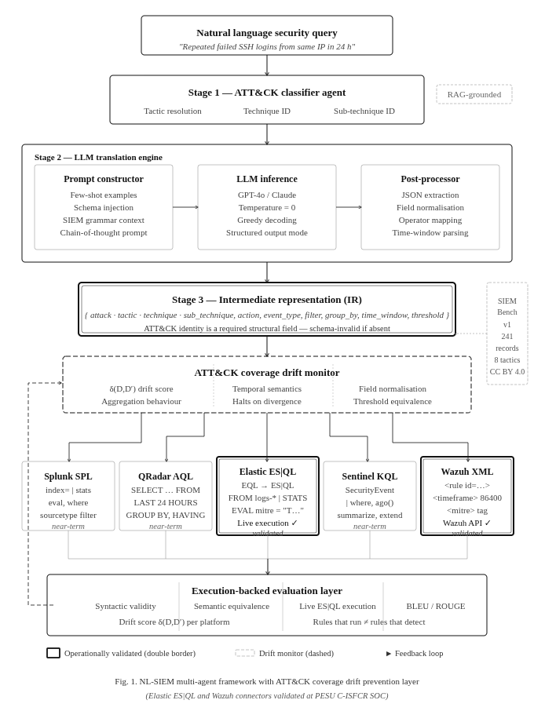

<div align="center">

<h1>NL-SIEM</h1>

<h3>Cross-Platform SIEM Detection Generation and ATT&CK Coverage Drift 
Prevention via Intermediate Representation and Multi-Agent LLMs</h3>

<p>
  
  
  
  
  
</p>

<p>
  <b>Elastic ES|QL</b> &nbsp;·&nbsp;
  <b>Elastic EQL</b> &nbsp;·&nbsp;
  <b>Wazuh XML</b> &nbsp;·&nbsp;
  <b>Splunk SPL</b> &nbsp;·&nbsp;
  <b>IBM QRadar AQL</b> &nbsp;·&nbsp;
  <b>Microsoft Sentinel KQL</b>
</p>

</div>

---

## The Problem: Your Heatmap Is Green But Your Detection Doesn't Fire

ATT&CK coverage heatmaps are how security teams communicate detection 
posture. The assumption behind them is that a technique marked covered 
has a working detection behind it.

In multi-SIEM environments, that assumption breaks silently.

Organizations accumulate SIEM platforms over time — cloud migrations, 
acquisitions, regulatory mandates, vendor transitions. Detections get 
ported across platforms manually or through informal scripting. When 
they cross platform boundaries, differences in field naming, time 
window semantics, aggregation behavior, and threshold expression 
silently degrade them. The ported rule deploys. The heatmap stays 
green. The detection no longer catches the same behavior.

We call this **ATT&CK Coverage Drift**: the divergence between 
documented ATT&CK coverage and actual cross-platform detection 
capability.

It also happens within a single vendor. Elastic Security's transition 
from EQL to ES|QL means existing rule libraries need conversion — 
the two languages differ fundamentally in execution model, not just 
syntax.

**NL-SIEM** prevents drift by treating ATT&CK identity as a structural 
input to detection generation, not a label attached afterward.

---

## How It Works

```
Traditional workflow:
  Write detection in Splunk → ATT&CK label copied to each port
  Port to QRadar            → label survives, semantics drift
  Port to Elastic           → label survives, semantics drift
  Port to Wazuh             → label survives, semantics drift
  Heatmap: green. Coverage: decayed.

NL-SIEM workflow:
  Analyst describes behavior in plain English
    ↓
  ATT&CK Classifier resolves tactic / technique / sub-technique
    ↓
  Intermediate Representation encodes ATT&CK identity +
  detection semantics as a required structural field, not metadata
    ↓
  Independent translation agents for each platform
  all inherit the same ATT&CK-bound contract
    ↓
  Syntactically valid, semantically consistent,
  ATT&CK-faithful detections across every platform
```

---

## Architecture

<p align="center">
  
  <br>
  <em>Figure 1: NL-SIEM Multi-Agent Architecture</em>
</p>
```
Natural Language Query
  │
  ▼
ATT&CK Classifier Agent          src/agents/attck_classifier_agent.py
  RAG over locally indexed MITRE ATT&CK corpus
  all-MiniLM-L6-v2 · FAISS · runs fully local · no external API
  Resolves: tactic · technique · sub-technique
  Halts explicitly on classification failure — no silent guessing
  │
  ▼
Parser Agent + IR Construction   src/agents/parser_agent.py
  │                              src/ir/schema.py · validator.py
  ▼
Intermediate Representation
  Required fields:
    attack       tactic · technique · sub-technique (schema-invalid if absent)
    action       filter | filter+aggregate
    event_type   authentication | network | process | ...
    filter       field · operator · value in canonical normalized form
    group_by     aggregation dimensions
    time_window  canonical duration (24h · 5m · 1h)
    threshold    comparison expression (>50 · >=10)
  │
  ├──► Elastic ES|QL Agent    src/translators/elastic.py
  │      EVAL mitre_sub_technique = "T1110.001"
  │      Live execution: src/connectors/elastic_connector.py
  │
  ├──► EQL→ES|QL Bridge       src/translators/esql_converter.py
  │      filter+aggregate class only
  │      ESQLConversionError on sequence input — no silent approximation
  │
  ├──► Wazuh Agent             src/translators/wazuh.py
  │      <mitre><id>T1110.001</id></mitre>
  │      Live deployment: src/connectors/wazuh_connector.py
  │
  ├──► Splunk Agent            src/translators/splunk.py
  │      connector: src/connectors/splunk_connector.py (near-term)
  │
  ├──► QRadar Agent            src/translators/qradar.py
  │      connector: near-term
  │
  └──► Sentinel Agent          src/translators/sentinel.py
         connector: near-term
  │
  ▼
Execution Agent                  src/agents/execution_agent.py
  Submit · retrieve results · ATT&CK fidelity check
  Elastic + Wazuh: live, validated at PESU C-ISFCR SOC


RAG retrieval: six corpora indexed separately under 
`src/knowledge_base/` — one per platform plus MITRE ATT&CK. Each 
translation agent retrieves k=2 chunks per platform across all five 
SIEM corpora simultaneously. Classifier retrieves top-5 from MITRE 
corpus. All retrieval runs locally — no external embedding API.
```
```
---

## End-to-End Example

Input: *"Repeated failed SSH authentication attempts from the same 
source IP over 24 hours"*

No ATT&CK identifier provided. No platform selected.

**ATT&CK Classification**
```
Tactic:        Credential Access
Technique:     T1110 — Brute Force
Sub-technique: T1110.001 — Password Guessing
```

**Intermediate Representation**
```json
{
  "attack": {
    "tactic":        "credential-access",
    "technique":     "T1110",
    "sub_technique": "T1110.001"
  },
  "action":      "filter+aggregate",
  "event_type":  "authentication",
  "filter": {
    "field": "status",
    "op":    "eq",
    "value": "failed"
  },
  "group_by":    ["src_ip"],
  "time_window": "24h",
  "threshold":   { "count": ">50" }
}
```

**Elastic ES|QL** ✓ live execution validated
```sql
FROM logs-*
| WHERE event.category == "authentication"
    AND event.outcome  == "failure"
    AND @timestamp >= NOW() - 24 hours
| STATS failed_count = COUNT() BY source.ip
| WHERE failed_count > 50
| EVAL mitre_sub_technique = "T1110.001"
```

**Wazuh XML** ✓ live deployment validated
```xml
<rule id="100050" level="10">
  <if_sid>5503</if_sid>
  <same_source_ip/>
  <frequency>50</frequency>
  <timeframe>86400</timeframe>
  <description>
    Brute force: 50+ failed SSH logins from
    single source IP in 24h [T1110.001]
  </description>
  <mitre>
    <id>T1110.001</id>
  </mitre>
</rule>
```

**Splunk SPL**
```
index=* status=failed earliest=-24h
| stats count by src_ip
| where count > 50
```

**IBM QRadar AQL**
```sql
SELECT sourceip, COUNT(*) AS attempts
FROM events
WHERE status = 'failed'
GROUP BY sourceip
HAVING attempts > 50
LAST 24 HOURS
```

**Microsoft Sentinel KQL**
```kql
SecurityEvent
| where TimeGenerated >= ago(24h)
| where EventID == 4625
| summarize FailedAttempts = count() by IpAddress
| where FailedAttempts > 50
```

The time window travels as `24 hours` in ES|QL and `86400` seconds 
in Wazuh's `<timeframe>`. The ATT&CK sub-technique propagates into 
every output. The IR is the single source of truth.

---

## EQL → ES|QL Syntax Bridge

`src/translators/esql_converter.py`

Elastic's detection ecosystem is mid-transition from EQL to ES|QL. 
The bridge handles conversion for filter-and-aggregate-class rules.

| Mismatch | EQL | ES|QL mapping |
|---|---|---|
| Event-type scoping | `authentication where ...` implicit | Explicit `WHERE event.category` injected from IR `event_type` |
| Aggregation | `stats count = count() by source.ip` | `STATS count = COUNT() BY source.ip` |
| Threshold | `where count > 50` | `WHERE count > 50` |
| ECS alias expansion | Short aliases valid in event-type blocks | Fully qualified paths required; pre-processing step in bridge |
| Null handling in groups | Null keys included | `COALESCE` wrapper injected |
| Time anchor | `within` measures inter-event span | `@timestamp` filter from query time — documented semantic difference |
| Sequence correlation | Native `sequence` keyword | **Not supported — `ESQLConversionError` raised explicitly** |

Sequence constructs throw an error rather than producing a wrong 
answer. That is intentional. Sequence support is the next roadmap 
item.

All filter+aggregate ES|QL output is verified against Elastic's 
`_query/esql` validation endpoint.

---

## SIEMBench v1

`data/siembench.jsonl` · `data/siembench.train.jsonl` · 
`data/siembench.dev.jsonl` · `data/siembench.test.jsonl`

241 JSONL records pairing natural-language queries with ATT&CK 
annotations and IR encodings. The first open benchmark for 
cross-platform detection generation that treats ATT&CK provenance 
as a first-class property.

| Property | Value |
|---|---|
| Total records | 241 |
| Format | JSONL |
| ATT&CK tactics | Initial Access · Execution · Persistence · Privilege Escalation · Defense Evasion · Credential Access · Discovery · Exfiltration |
| Complexity tiers | Simple · Intermediate · Complex |
| Fields per record | NL query · tactic · technique · sub-technique · complexity · IR |
| License | CC BY 4.0 |

```json
{
  "id":            "SB-042",
  "nl_query":      "Detect outbound connections to known threat 
                    intel IPs, last hour",
  "tactic":        "exfiltration",
  "technique":     "T1048",
  "sub_technique": "T1048.003",
  "complexity":    "intermediate",
  "ir": {
    "attack": {
      "tactic":        "exfiltration",
      "technique":     "T1048",
      "sub_technique": "T1048.003"
    },
    "action":      "filter+aggregate",
    "event_type":  "network",
    "filter": {
      "field": "dst_ip",
      "op":    "in",
      "value": "$TI_IP_LIST"
    },
    "group_by":    ["destination.ip"],
    "time_window": "1h",
    "threshold":   { "count": ">1" }
  }
}
```

---

## Connectors

| Platform | Capability | Status |
|---|---|---|
| Elastic Security | ES|QL live execution via `_query/esql` | ✓ Implemented · validated at C-ISFCR |
| Elastic Security | EQL→ES|QL bridge (filter+aggregate) | ✓ Implemented · partial |
| Wazuh | Rule deployment + validation via Wazuh API | ✓ Implemented · validated at C-ISFCR |
| Splunk | SPL REST API execution | Near-term |
| IBM QRadar | AQL query execution | Near-term |
| Microsoft Sentinel | Azure Monitor API | Near-term |

The Elastic and Wazuh connectors have been used in a production 
detection engineering workflow at PESU C-ISFCR, PES University. 
This is execution-backed validation — not syntax checking.

---

## Installation

```bash
git clone https://github.com/Shubhambhat06/nl-siem.git
cd nl-siem

python -m venv venv
source venv/bin/activate        # Windows: venv\Scripts\activate

pip install -r requirements.txt

cp .env.example .env
# Add your LLM API key:
# OPENAI_API_KEY=...  or  GOOGLE_API_KEY=...
```

The RAG pipeline runs fully locally. No embedding API key needed.

---

## Quickstart

```bash
# Ingest knowledge base (first time only)
python scripts/ingest_knowledge_base.py

# Translate a query
python scripts/translate_query.py \
  --query "Detect repeated failed SSH logins from the same IP" \
  --platforms elastic wazuh splunk
```

---

## Running the ATT&CK Coverage Audit

```bash
# Pre-deployment audit
python scripts/run_attck_coverage_audit.py --mode pre

# Post-deployment audit  
python scripts/run_attck_coverage_audit.py --mode post

# Results land in:
# experiments/results/attck_coverage/pre_deployment_audit.json
# experiments/results/attck_coverage/post_deployment_audit.json
```

---

## Running Evaluations

```bash
# Full evaluation on SIEMBench v1
python scripts/run_evaluation.py \
  --dataset data/siembench.test.jsonl \
  --condition ir+rag \
  --output experiments/results/

# Ablation configs live in experiments/configs/
# ablation_ir_rag.yaml · ablation_ir_only.yaml · ablation_zero_shot.yaml
python scripts/run_evaluation.py \
  --config experiments/configs/ablation_zero_shot.yaml
```

---

## Repository Structure

```
nl-siem/
│
├── configs/                    platform connector configs
│   ├── elastic.yaml
│   ├── wazuh.yaml
│   ├── splunk.yaml
│   ├── qradar.yaml
│   └── sentinel.yaml
│
├── data/                       SIEMBench v1 dataset
│   ├── siembench.jsonl         full dataset (241 records)
│   ├── siembench.train.jsonl
│   ├── siembench.dev.jsonl
│   ├── siembench.test.jsonl
│   ├── siembench_attck.jsonl   ATT&CK-annotated split
│   ├── stats.json
│   ├── manifest.json
│   └── DATASET_CARD.md
│
├── experiments/
│   ├── configs/                ablation experiment configs
│   │   ├── ablation_ir_rag.yaml
│   │   ├── ablation_ir_only.yaml
│   │   └── ablation_zero_shot.yaml
│   └── results/attck_coverage/
│       ├── pre_deployment_audit.json
│       └── post_deployment_audit.json
│
├── knowledge_base/             MITRE ATT&CK enterprise JSON
│
├── scripts/                    CLI entrypoints
│   ├── translate_query.py
│   ├── ingest_knowledge_base.py
│   ├── build_siembench.py
│   ├── generate_dataset.py
│   ├── label_attck.py
│   ├── run_attck_coverage_audit.py
│   ├── run_evaluation.py
│   └── export_tables.py
│
├── src/
│   ├── agents/                 pipeline orchestration
│   │   ├── attck_classifier_agent.py
│   │   ├── parser_agent.py
│   │   ├── validator_agent.py
│   │   ├── refinement_agent.py
│   │   ├── translation_orchestrator.py
│   │   ├── execution_agent.py
│   │   └── rule_deployment_agent.py
│   │
│   ├── ir/                     IR schema and validation
│   │   ├── schema.py
│   │   ├── attck_schema.py
│   │   ├── validator.py
│   │   ├── ir_to_nl.py
│   │   └── examples.json
│   │
│   ├── translators/            per-platform translation
│   │   ├── elastic.py
│   │   ├── esql_converter.py   EQL→ES|QL bridge
│   │   ├── wazuh.py
│   │   ├── splunk.py
│   │   ├── qradar.py
│   │   ├── sentinel.py
│   │   ├── field_mapping.py
│   │   └── base.py
│   │
│   ├── connectors/             execution layer
│   │   ├── elastic_connector.py
│   │   ├── wazuh_connector.py
│   │   ├── splunk_connector.py
│   │   ├── factory.py
│   │   └── base.py
│   │
│   ├── rag/                    local retrieval pipeline
│   │   ├── retriever.py
│   │   ├── embedder.py         all-MiniLM-L6-v2
│   │   ├── vector_store.py     FAISS-backed
│   │   ├── chunker.py
│   │   └── ingest.py
│   │
│   ├── evaluation/             benchmarking and scoring
│   │   ├── syntax_validator.py
│   │   ├── semantic_scorer.py
│   │   ├── attck_fidelity_scorer.py
│   │   ├── attck_coverage_auditor.py
│   │   ├── execution_match.py
│   │   ├── error_analyzer.py
│   │   ├── metrics_aggregator.py
│   │   └── ablation.py
│   │
│   ├── knowledge_base/         indexed SIEM + MITRE docs
│   │   ├── elastic/
│   │   ├── wazuh/
│   │   ├── splunk/
│   │   ├── qradar/
│   │   ├── sentinel/
│   │   └── mitre/
│   │
│   ├── llm/                    LLM abstraction layer
│   │   ├── client.py
│   │   ├── prompts.py
│   │   ├── response_parser.py
│   │   └── token_counter.py
│   │
│   └── utils/
│       ├── config.py
│       ├── logger.py
│       ├── file_io.py
│       └── exceptions.py
│
└── tests/
    └── connectors/
        ├── test_splunk_connector.py
        └── test_wazuh_connector.py
```

---

## Limitations

- EQL sequence constructs are not converted by the current bridge.
  `ESQLConversionError` is raised explicitly rather than emitting
  an approximate translation. Sequence support is the next roadmap
  item.
- Splunk, QRadar, and Sentinel execution connectors are not yet
  implemented. Translation agents for these platforms are functional;
  live execution validation is pending.
- The RAG retrieval layer uses `all-MiniLM-L6-v2`, a general-purpose
  encoder not fine-tuned on security text. Techniques with similar
  surface descriptions are a known misclassification risk.
- Retrieval hyperparameters (k=5 classifier, k=2 per platform for
  translators) were set heuristically.

---

## Research

Built at PESU Centre for Information Security, Forensics and Cyber 
Resilience (C-ISFCR), PES University, Bengaluru.

Companion paper: *Detecting What You Think You Detect: Cross-Platform 
SIEM Query Generation and ATT&CK Coverage Drift Prevention via 
Intermediate Representation and Multi-Agent LLMs* — preprint under 
review.

---

## Citation

```bibtex
@article{bhat2025nlsiem,
  title   = {Detecting What You Think You Detect: Cross-Platform SIEM
             Query Generation and ATT\&CK Coverage Drift Prevention
             via Intermediate Representation and Multi-Agent LLMs},
  author  = {Bhat, Shubham Dattatraya},
  year    = {2025},
  note    = {Preprint under review. Research conducted at PESU C-ISFCR,
             PES University, Bengaluru.}
}
```

---

## License

Code — [MIT License](LICENSE)  
Dataset (SIEMBench v1) — [CC BY 4.0](https://creativecommons.org/licenses/by/4.0/)

---

<div align="center">
<sub>
Built at PESU C-ISFCR · Black Hat Arsenal India 2026 · 
Issues and PRs welcome
</sub>
</div>
