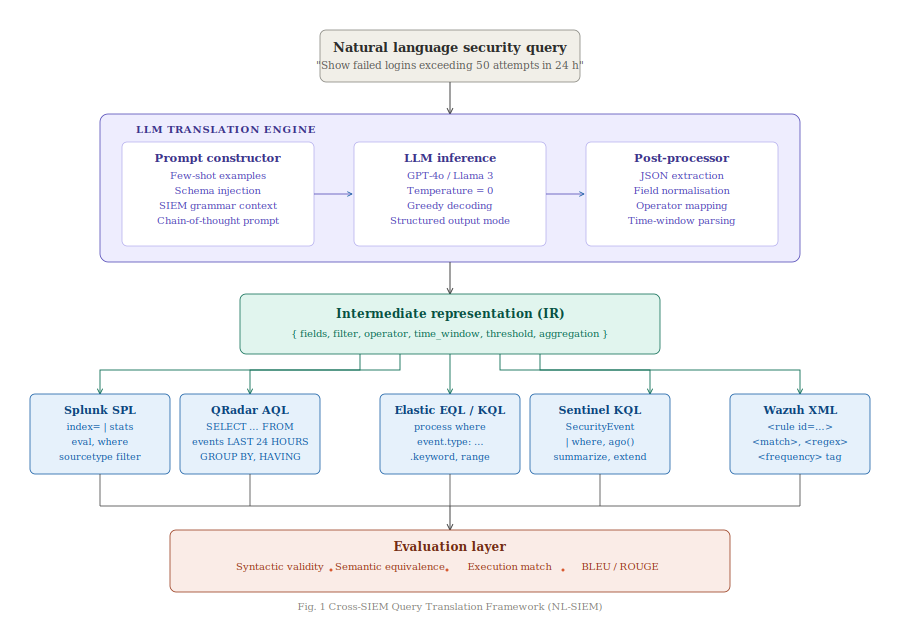

<div align="center">

<h1>NL-SIEM</h1>

<h3>Cross-Platform SIEM Query Translation via Large Language Models<br>and Intermediate Representation</h3>

<p>
  <a href="https://arxiv.org/abs/XXXX.XXXXX">
    
  </a>
  &nbsp;
  
  &nbsp;
  
  &nbsp;
  
  &nbsp;
  
</p>

<p>
  <b>Splunk SPL</b> &nbsp;·&nbsp;
  <b>IBM QRadar AQL</b> &nbsp;·&nbsp;
  <b>Elastic EQL / KQL</b> &nbsp;·&nbsp;
  <b>Microsoft Sentinel KQL</b> &nbsp;·&nbsp;
  <b>Wazuh XML</b>
</p>

</div>

---

## Overview

Security Operations Center (SOC) analysts working across heterogeneous SIEM environments face a fundamental interoperability problem: each platform enforces its own incompatible query language, requiring every detection rule to be manually rewritten per platform. This process is slow, error-prone, and demands deep per-platform expertise that most teams lack.

**NL-SIEM** is a multi-agent large language model framework that takes a natural language threat detection description as input and produces syntactically valid, semantically equivalent queries across five major SIEM platforms simultaneously. The core technical contribution is a **platform-agnostic Intermediate Representation (IR)** — a formally specified JSON schema that decouples natural language comprehension from platform-specific syntax generation. Combined with Retrieval-Augmented Generation (RAG) over curated SIEM documentation and structured few-shot chain-of-thought prompting, NL-SIEM achieves strong cross-platform translation fidelity without requiring manual query rewriting.

We also release **SIEMBench** — the first publicly available annotated benchmark dataset for cross-platform SIEM query translation, comprising 200+ expert-authored natural language to multi-platform query pairs stratified across six MITRE ATT&CK tactic categories.

---

## System Architecture

<div align="center">
  
</div>

> *Figure 1. End-to-end NL-SIEM pipeline: natural language input is parsed by the LLM agent into a platform-agnostic IR, which is then independently formatted by five SIEM-specific translators and passed through a multi-dimensional evaluation layer.*

---

## Research Contributions

| # | Contribution | Description |
|---|---|---|
| 1 | **NL-SIEM Pipeline** | End-to-end multi-agent architecture: NL → IR → 5 SIEM outputs via a clean abstraction boundary between comprehension and generation |
| 2 | **Intermediate Representation Schema** | Platform-agnostic JSON schema encoding detection primitives: field references, logical operators, temporal windows, aggregation functions, threshold conditions |
| 3 | **SIEMBench v1** | 200+ expert-annotated NL–query pairs across 5 platforms, stratified by ATT&CK tactic and query complexity. First open benchmark for this task. |
| 4 | **Evaluation Framework** | Three-dimensional evaluation: syntactic validity, semantic equivalence (BLEU-4, field-match F1), and execution match |
| 5 | **Ablation Study** | Systematic comparison of zero-shot vs. few-shot, with-IR vs. without-IR, and GPT-4o vs. Gemini vs. Llama 3 |

---

## Motivation

```
Analyst writes a detection rule in Splunk SPL
        ↓
Same rule needed in QRadar AQL    →  Rewrite manually
Same rule needed in Elastic EQL   →  Rewrite manually  
Same rule needed in Sentinel KQL  →  Rewrite manually
Same rule needed in Wazuh XML     →  Rewrite manually

                   4× the work. 4× the risk of error.
```

With NL-SIEM:
```
Analyst describes intent in natural language
        ↓
NL-SIEM generates all 5 platform queries simultaneously
        ↓
Validated, syntactically correct, semantically equivalent
```

---

## How It Works

A single natural language description — *"Detect repeated failed SSH logins from the same source IP exceeding 50 attempts within 24 hours"* — produces:

**Intermediate Representation (IR)**
```json
{
  "action": "filter+aggregate",
  "event_type": "authentication",
  "filter": {
    "field": "status",
    "op": "eq",
    "value": "failed"
  },
  "group_by": ["src_ip"],
  "time_window": "24h",
  "threshold": { "count": ">50" }
}
```

**Splunk SPL**
```spl
index=* status=failed earliest=-24h
| stats count by src_ip
| where count > 50
```

**IBM QRadar AQL**
```sql
SELECT sourceip, COUNT(*) as attempts
FROM events
WHERE status = 'failed'
  AND LOGSOURCETYPENAME(devicetype) = 'SSH'
GROUP BY sourceip
HAVING attempts > 50
LAST 24 HOURS
```

**Elastic EQL**
```eql
authentication where event.outcome == "failure"
| stats count = count() by source.ip
| where count > 50
  and @timestamp >= now() - 24h
```

**Microsoft Sentinel KQL**
```kql
SecurityEvent
| where TimeGenerated >= ago(24h)
| where EventID == 4625
| summarize FailedAttempts = count() by IpAddress
| where FailedAttempts > 50
```

**Wazuh XML Rule**
```xml
<rule id="100050" level="10">
  <if_sid>5503</if_sid>
  <same_source_ip/>
  <frequency>50</frequency>
  <timeframe>86400</timeframe>
  <description>Brute force: 50+ failed SSH logins from same IP in 24h</description>
  <mitre><id>T1110</id></mitre>
</rule>
```

---

## Dataset — SIEMBench v1

SIEMBench is the first benchmark dataset specifically constructed for cross-platform SIEM query translation research.

| Property | Value |
|---|---|
| Total annotated pairs | 200+ |
| Platforms | Splunk, QRadar, Elastic, Sentinel, Wazuh |
| MITRE ATT&CK tactics | Initial Access, Execution, Persistence, Privilege Escalation, Lateral Movement, Exfiltration |
| Complexity levels | Simple · Intermediate · Complex |
| Annotation | Expert-authored ground truth + dual security analyst review |
| Format | JSON with NL query, IR, per-platform ground truth, tactic label, complexity tier |
| License | CC BY 4.0 |

**Schema example:**
```json
{
  "id": "SB-042",
  "nl_query": "Detect outbound connections to known threat intelligence IPs in the last hour",
  "tactic": "exfiltration",
  "complexity": "intermediate",
  "ir": {
    "action": "filter",
    "event_type": "network",
    "filter": { "field": "dst_ip", "op": "in", "value": "$TI_IP_LIST" },
    "direction": "outbound",
    "time_window": "1h"
  },
  "ground_truth": {
    "splunk": "index=network_traffic Direction=outbound earliest=-1h | lookup threat_intel dst_ip OUTPUT is_malicious | where is_malicious=true",
    "qradar": "SELECT * FROM events WHERE destinationip IN (SELECT ioc FROM threat_intel) LAST 1 HOURS",
    "elastic": "network where destination.ip in (~threat_intel_ips) and network.direction == \"outbound\"",
    "sentinel": "CommonSecurityLog | where TimeGenerated >= ago(1h) | where DestinationIP in (ThreatIntelIndicators)",
    "wazuh": "<rule id=\"100042\"><if_sid>0</if_sid><match>outbound</match><description>TI IP match</description></rule>"
  }
}
```

---

## Experimental Results

### Syntactic Validity (%)

| Condition | Splunk | QRadar | Elastic | Sentinel | Wazuh | **Avg** |
|---|---|---|---|---|---|---|
| GPT-4o + IR + RAG | **94.1** | **89.3** | **92.7** | **93.5** | **87.2** | **91.4** |
| GPT-4o + IR | 88.6 | 83.1 | 87.4 | 89.0 | 81.5 | 85.9 |
| GPT-4o Zero-shot | 71.2 | 64.8 | 69.3 | 72.1 | 61.4 | 67.8 |
| Llama 3 + IR + RAG | 82.3 | 76.9 | 80.1 | 81.7 | 74.6 | 79.1 |
| Gemini + IR + RAG | 85.4 | 79.2 | 83.6 | 84.9 | 78.0 | 82.2 |

### Semantic Equivalence — BLEU-4

| Condition | Splunk | QRadar | Elastic | Sentinel | Wazuh | **Avg** |
|---|---|---|---|---|---|---|
| GPT-4o + IR + RAG | **0.71** | **0.64** | **0.69** | **0.72** | **0.61** | **0.67** |
| GPT-4o + IR | 0.63 | 0.56 | 0.61 | 0.65 | 0.53 | 0.60 |
| GPT-4o Zero-shot | 0.43 | 0.38 | 0.41 | 0.44 | 0.35 | 0.40 |

> *Placeholder values — replace with actual results after running experiments.*  
> *Full ablation tables, field-match F1 scores, and error analysis in the paper.*

---

## Installation

```bash
# Clone
git clone https://github.com/yourusername/siem-query-translator.git
cd siem-query-translator

# Virtual environment
python -m venv venv
source venv/bin/activate        # Windows: venv\Scripts\activate

# Dependencies
pip install -r requirements.txt

# Environment
cp .env.example .env
# Add: GOOGLE_API_KEY=... or OPENAI_API_KEY=...
```

---

## Quickstart

```python
from src.main import NLSIEMTranslator

translator = NLSIEMTranslator()

result = translator.translate(
    query="Detect more than 10 failed login attempts "
          "from the same user within 5 minutes",
    platforms=["splunk", "qradar", "elastic", "sentinel", "wazuh"]
)

print(result["ir"])          # Intermediate Representation
print(result["splunk"])      # Splunk SPL
print(result["qradar"])      # IBM QRadar AQL
print(result["elastic"])     # Elastic EQL
print(result["sentinel"])    # Microsoft Sentinel KQL
print(result["wazuh"])       # Wazuh XML Rule
```

---

## Running Evaluations

```bash
# Full evaluation on SIEMBench v1
python scripts/run_evaluation.py \
  --dataset  datasets/benchmark/siembench_v1.json \
  --model    gpt-4o \
  --condition ir+rag \
  --output   experiments/results/raw/

# Aggregate metrics and generate paper tables
python scripts/export_tables.py \
  --results  experiments/results/raw/ \
  --output   experiments/results/aggregated/
```

---

## Repository Structure

```
siem-query-translator/
├── src/
│   ├── agents/          # Parser, validator, translation agents
│   ├── ir/              # IR schema definition and validators
│   ├── translators/     # Per-platform output formatters (5 SIEMs)
│   ├── llm/             # LLM client, prompt templates, response parser
│   ├── rag/             # Embeddings, vector store, retriever
│   ├── evaluation/      # Syntax, semantic, and execution metrics
│   └── utils/           # Config, logging, exceptions
├── knowledge_base/      # SIEM documentation corpora for RAG retrieval
├── datasets/
│   ├── raw/             # Source NL query bank
│   ├── benchmark/       # SIEMBench v1 annotated dataset
│   └── processed/       # Tokenized and embedded evaluation splits
├── experiments/
│   ├── few_shot/
│   ├── zero_shot/
│   ├── rag/
│   └── results/
│       ├── raw/         # Per-run JSON outputs
│       └── aggregated/  # Computed metric tables
├── scripts/             # run_evaluation.py, export_tables.py, generate_dataset.py
├── tests/               # Unit tests for all modules
└── docs/
    ├── architecture/    # architecture.svg (this diagram)
    └── paper/           # Figures, tables, draft PDF
```

---

## Platform Validation Setup

| Platform | Validation Method | Setup |
|---|---|---|
| Splunk Enterprise | Full execution | Free developer license (local) |
| Elastic SIEM | Full execution | Docker (`elasticsearch:8.x`) |
| Wazuh | Full execution | Docker (`wazuh-docker`) |
| Microsoft Sentinel KQL | Syntax + logic | Azure Data Explorer (free tier) |
| IBM QRadar AQL | Rule-based syntactic parser | Community Edition VM |

---

## Target Venues

- **RAID** — Research in Attacks, Intrusions and Defenses
- **IEEE DSC** — IEEE Conference on Dependable and Secure Computing  
- **ACL / EMNLP** — NLP for Cybersecurity Workshop track
- **arXiv cs.CR** — Preprint (immediate release on Day 20)

---

## Citation

If you use NL-SIEM or SIEMBench in your work, please cite:

```bibtex
@article{nlsiem2025,
  title   = {NL-SIEM: Cross-Platform SIEM Query Translation via
             Large Language Models and Intermediate Representation},
  author  = {Your Name and Supervisor Name},
  journal = {arXiv preprint arXiv:XXXX.XXXXX},
  year    = {2025},
  url     = {https://arxiv.org/abs/XXXX.XXXXX}
}
```

---

## License

Code — [MIT License](LICENSE)  
Dataset (SIEMBench v1) — [CC BY 4.0](https://creativecommons.org/licenses/by/4.0/)

---

<div align="center">
<sub>
  Built as part of a research internship &nbsp;·&nbsp;
  Preprint on arXiv coming soon &nbsp;·&nbsp;
  Issues and pull requests welcome
</sub>
</div>
