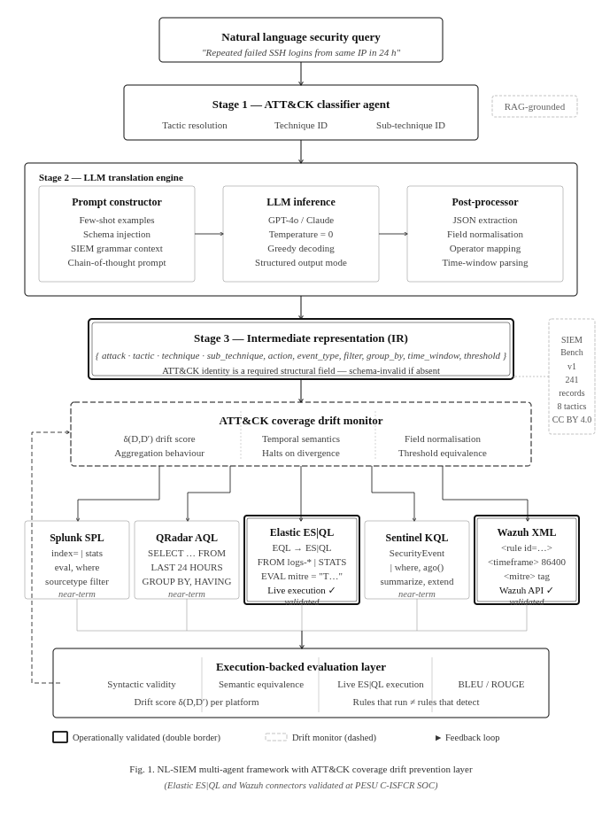

<div align="center">

<h1>NL-SIEM</h1>

<h3>Cross-Platform SIEM Detection Generation and ATT&CK Coverage Drift
Prevention via Intermediate Representation and Multi-Agent LLMs</h3>

<p>
  
  
  
  
  
</p>

<p>
  <b>Elastic ES|QL</b> &nbsp;·&nbsp;
  <b>Elastic EQL</b> &nbsp;·&nbsp;
  <b>Wazuh XML</b> &nbsp;·&nbsp;
  <b>Splunk SPL</b> &nbsp;·&nbsp;
  <b>IBM QRadar AQL</b> &nbsp;·&nbsp;
  <b>Microsoft Sentinel KQL</b>
</p>

</div>

---

## Table of Contents

- [The Problem](#the-problem-your-heatmap-is-green-but-your-detection-doesnt-fire)
- [How It Works](#how-it-works)
- [Architecture](#architecture)
- [End-to-End Example](#end-to-end-example)
- [EQL → ES|QL Syntax Bridge](#eql--esql-syntax-bridge)
- [SIEMBench v1](#siembench-v1)
- [Connectors](#connectors)
- [Free-tier LLM support](#free-tier-llm-support)
- [Installation](#installation)
- [Quickstart](#quickstart)
- [Live execution (opt-in)](#live-execution-opt-in)
- [Running the ATT&CK Coverage Audit](#running-the-attck-coverage-audit)
- [Building SIEMBench and running evaluations](#building-siembench-and-running-evaluations)
- [Repository Structure](#repository-structure)
- [What is implemented vs. what is planned](#what-is-implemented-vs-what-is-planned)
- [Adding a new SIEM target](#adding-a-new-siem-target)
- [Troubleshooting](#troubleshooting)
- [Limitations](#limitations)
- [Research](#research) · [Citation](#citation) · [License](#license)

---

## The Problem: Your Heatmap Is Green But Your Detection Doesn't Fire

ATT&CK coverage heatmaps are how security teams communicate detection
posture. The assumption behind them is that a technique marked covered
has a working detection behind it.

In multi-SIEM environments, that assumption breaks silently.

Organizations accumulate SIEM platforms over time — cloud migrations,
acquisitions, regulatory mandates, vendor transitions. Detections get
ported across platforms manually or through informal scripting. When
they cross platform boundaries, differences in field naming, time
window semantics, aggregation behavior, and threshold expression
silently degrade them. The ported rule deploys. The heatmap stays
green. The detection no longer catches the same behavior.

We call this **ATT&CK Coverage Drift**: the divergence between
documented ATT&CK coverage and actual cross-platform detection
capability.

It also happens within a single vendor. Elastic Security's transition
from EQL to ES|QL means existing rule libraries need conversion —
the two languages differ fundamentally in execution model, not just
syntax.

**NL-SIEM** prevents drift by treating ATT&CK identity as a structural
input to detection generation, not a label attached afterward.

---

## How It Works

```
Traditional workflow:
  Write detection in Splunk → ATT&CK label copied to each port
  Port to QRadar            → label survives, semantics drift
  Port to Elastic           → label survives, semantics drift
  Port to Wazuh             → label survives, semantics drift
  Heatmap: green. Coverage: decayed.

NL-SIEM workflow:
  Analyst describes behavior in plain English
    ↓
  ATT&CK Classifier resolves tactic / technique / sub-technique
    ↓
  Intermediate Representation encodes ATT&CK identity +
  detection semantics as a required structural field, not metadata
    ↓
  Independent translation agents for each platform
  all inherit the same ATT&CK-bound contract
    ↓
  Syntactically valid, semantically consistent,
  ATT&CK-faithful detections across every platform
```

---

## Architecture

<p align="center">
  
  <br>
  <em>Figure 1: NL-SIEM Multi-Agent Architecture</em>
</p>

---

## End-to-End Example

Input: *"Repeated failed SSH authentication attempts from the same
source IP over 24 hours"*

No ATT&CK identifier provided. No platform selected.

> The outputs below are **illustrative** (shortened for readability).
> Real runs also append ATT&CK annotation lines/fields such as
> `| eval MITRETechniques="T1110.001"` to each query, and exact field
> choices vary with the LLM and the IR it produces.

**ATT&CK Classification**
```
Tactic:        Credential Access
Technique:     T1110 — Brute Force
Sub-technique: T1110.001 — Password Guessing
```

**Intermediate Representation**
```json
{
  "attack": {
    "tactic":        "credential-access",
    "technique":     "T1110",
    "sub_technique": "T1110.001"
  },
  "action":      "filter+aggregate",
  "event_type":  "authentication",
  "filter": {
    "field": "status",
    "op":    "eq",
    "value": "failed"
  },
  "group_by":    ["src_ip"],
  "time_window": "24h",
  "threshold":   { "count": ">50" }
}
```

**Elastic ES|QL** ✓ live execution validated
```sql
FROM logs-*
| WHERE event.category == "authentication"
    AND event.outcome  == "failure"
    AND @timestamp >= NOW() - 24 hours
| STATS failed_count = COUNT() BY source.ip
| WHERE failed_count > 50
| EVAL mitre_sub_technique = "T1110.001"
```

**Wazuh XML** ✓ live deployment validated
```xml
<rule id="100050" level="10">
  <if_sid>5503</if_sid>
  <same_source_ip/>
  <frequency>50</frequency>
  <timeframe>86400</timeframe>
  <description>
    Brute force: 50+ failed SSH logins from
    single source IP in 24h [T1110.001]
  </description>
  <mitre>
    <id>T1110.001</id>
  </mitre>
</rule>
```

**Splunk SPL**
```
index=* status=failed earliest=-24h
| stats count by src_ip
| where count > 50
```

**IBM QRadar AQL**
```sql
SELECT sourceip, COUNT(*) AS attempts
FROM events
WHERE status = 'failed'
GROUP BY sourceip
HAVING attempts > 50
LAST 24 HOURS
```

**Microsoft Sentinel KQL**
```kql
SecurityEvent
| where TimeGenerated >= ago(24h)
| where EventID == 4625
| summarize FailedAttempts = count() by IpAddress
| where FailedAttempts > 50
```

The time window travels as `24 hours` in ES|QL and `86400` seconds
in Wazuh's `<timeframe>`. The ATT&CK sub-technique propagates into
every output. The IR is the single source of truth.

---

## EQL → ES|QL Syntax Bridge

`src/translators/esql_converter.py`

Elastic's detection ecosystem is mid-transition from EQL to ES|QL. The
bridge handles conversion for filter-and-aggregate-class rules.

| Mismatch | EQL | ES\|QL mapping |
|---|---|---|
| Event-type scoping | `authentication where ...` implicit | Explicit `WHERE event.category` injected from IR `event_type` |
| Aggregation | `stats count = count() by source.ip` | `STATS count = COUNT() BY source.ip` |
| Threshold | `where count > 50` | `WHERE count > 50` |
| ECS alias expansion | Short aliases valid in event-type blocks | Fully qualified paths required; pre-processing step in bridge |
| Null handling in groups | Null keys included | `COALESCE` wrapper injected |
| Time anchor | `within` measures inter-event span | `@timestamp` filter from query time — documented semantic difference |
| Sequence correlation | Native `sequence` keyword | **Not supported — `ESQLConversionError` raised explicitly** |

Sequence constructs throw an error rather than producing a wrong answer.
That is intentional. Sequence support is the next roadmap item.

```python
from src.translators.esql_converter import ElasticQueryConverter, ESQLConversionError

eql = '''authentication where event.outcome == "failure"
| stats failed_count = count() by source.ip
| where failed_count > 50'''

print(ElasticQueryConverter.to_esql(eql, index_pattern="logs-*"))
# The default index pattern is "nlsiem-test" — pass index_pattern for your own data.
```

Filter+aggregate ES|QL output is verified against Elastic's `_query/esql`
validation endpoint when the Elastic connector is configured
(see [Live execution](#live-execution-opt-in)).

---

## SIEMBench v1

First open benchmark for cross-platform detection generation that treats
ATT&CK provenance as a first-class property: natural-language queries
paired with ATT&CK annotations and IR encodings.

| Property | Value |
|---|---|
| Total records | 241 |
| Format | JSONL (`data/siembench.jsonl`, `.train`, `.dev`, `.test`) |
| ATT&CK tactics | Initial Access · Execution · Persistence · Privilege Escalation · Defense Evasion · Credential Access · Discovery · Exfiltration |
| Complexity tiers | Simple · Intermediate · Complex |
| Fields per record | NL query · tactic · technique · sub-technique · complexity · IR |
| License | CC BY 4.0 |

```json
{
  "id":            "SB-042",
  "nl_query":      "Detect outbound connections to known threat intel IPs, last hour",
  "tactic":        "exfiltration",
  "technique":     "T1048",
  "sub_technique": "T1048.003",
  "complexity":    "intermediate",
  "ir": {
    "attack": {
      "tactic":        "exfiltration",
      "technique":     "T1048",
      "sub_technique": "T1048.003"
    },
    "action":      "filter+aggregate",
    "event_type":  "network",
    "filter": {
      "field": "dst_ip",
      "op":    "in",
      "value": "$TI_IP_LIST"
    },
    "group_by":    ["destination.ip"],
    "time_window": "1h",
    "threshold":   { "count": ">1" }
  }
}
```

### Where the data lives in this repository

- **Committed:** `backups/siembench_250_gold.jsonl` — 250 gold **seed**
  queries (`id`, `category`, `complexity` = low/medium/high, `nl_query`).
  These have no ATT&CK labels, IR, or splits yet.
- **Generated, not committed:** the annotated, split files
  (`data/siembench.*.jsonl`, `manifest.json`, `stats.json`). `data/` is in
  `.gitignore`. Rebuild them with
  [Building SIEMBench](#building-siembench-and-running-evaluations)
  (requires an LLM provider).

---

## Connectors

| Platform | Capability | Status |
|---|---|---|
| Elastic Security | ES\|QL live execution via `_query/esql` | ✓ Implemented · validated at C-ISFCR |
| Elastic Security | EQL→ES\|QL bridge (filter+aggregate) | ✓ Implemented · partial |
| Wazuh | Rule deployment + validation via Wazuh API | ✓ Implemented · validated at C-ISFCR |
| Splunk | SPL REST API execution (`splunk_connector.py`) | Implemented · live validation pending |
| IBM QRadar | AQL query execution | Near-term (translator only today) |
| Microsoft Sentinel | Azure Monitor API | Near-term (translator only today) |

The Elastic and Wazuh connectors have been used in a production
detection engineering workflow at PESU C-ISFCR, PES University. This is
execution-backed validation — not syntax checking.

All connectors are **opt-in**: nothing touches a live SIEM unless you ask
for it (see [Live execution](#live-execution-opt-in)).

---

## Free-tier LLM support

This is a deliberate design constraint, not a fallback. `src/llm/client.py`
talks to four providers, all usable without a paid API key. Groq, Ollama
and OpenRouter are reached through the OpenAI-compatible SDK; Gemini uses
`google-generativeai`.

| Provider | `LLM_PROVIDER` | Key variable | Default model (override with `LLM_MODEL`) |
|---|---|---|---|
| **Groq** | `groq` | `GROQ_API_KEY` | `openai/gpt-oss-120b` |
| **Google Gemini** | `gemini` | `GOOGLE_API_KEY` | `gemini-2.0-flash` |
| **Ollama** (fully local) | `ollama` | none | `llama3.1` |
| **OpenRouter** | `openrouter` | `OPENROUTER_API_KEY` | `meta-llama/llama-3.1-70b-instruct:free` |

Free-tier limits and available model names change over time. The client
ships a built-in rate limiter (defaults: Groq 30 req/min, Gemini 15
req/min, OpenRouter 20 req/min) — check your provider's current limits and
set `LLM_MODEL` if a default model has been retired.

```python
from src.llm.client import LLMClient

# Reads LLM_PROVIDER / LLM_MODEL / keys from the environment or .env (default provider: groq)
client = LLMClient.from_env()

# Or explicit
client = LLMClient(provider="ollama", model="llama3.1")
```

`OLLAMA_HOST` defaults to `http://localhost:11434`. `src/llm/token_counter.py`
tracks token usage per run; it uses `tiktoken` when it can load its
vocabulary and otherwise falls back to a character-based estimate, so it
also works offline.

---

## Installation

Run everything from the **repository root** — the project is used as a
source tree (`import src...`), not as an installable package.

### Prerequisites

- Python 3.10+ (tested on 3.12)
- git
- (Optional) [Ollama](https://ollama.com) to run the LLM fully locally
- Internet access on first use of RAG (downloads the ~90 MB
  `all-MiniLM-L6-v2` embedding model from Hugging Face, then cached)

### 1. Clone

```bash
git clone https://github.com/Shubhambhat06/Cross-SIEM-Query-Translation-Framework.git
cd Cross-SIEM-Query-Translation-Framework
```

### 2. Create a virtual environment

```bash
python -m venv venv
source venv/bin/activate        # Windows: venv\Scripts\activate
```

### 3. Install dependencies

```bash
# (Recommended on machines without an NVIDIA GPU — avoids a multi-GB CUDA download)
pip install torch --index-url https://download.pytorch.org/whl/cpu

pip install -r requirements.txt
```

`requirements.txt` contains: `pydantic`, `pydantic-settings`,
`python-dotenv`, `rich`, `numpy`, `requests`, `openai`,
`google-generativeai`, `tiktoken`, `sentence-transformers`, `faiss-cpu`,
`elasticsearch`, `sacrebleu`, `pytest`.

### 4. Configure your LLM provider

```bash
cp .env.example .env            # Windows: copy .env.example .env
```

Edit `.env` — pick **one** provider:

```ini
LLM_PROVIDER=groq
GROQ_API_KEY=your_key_here
# LLM_MODEL=                      # optional override

# LLM_PROVIDER=gemini
# GOOGLE_API_KEY=your_key_here

# LLM_PROVIDER=ollama
# OLLAMA_HOST=http://localhost:11434

LOG_LEVEL=INFO
```

`.env` is loaded automatically by `src/llm/client.py` and is listed in
`.gitignore` — never commit it. Do not set `MODEL_NAME`; use `LLM_MODEL`.

### 5. Verify the install (no API key or network needed)

```bash
python sanity_check_layer_0.py        # foundation layer — expect 34/34 passed
```

Then confirm the IR → five-platform translators work. Save as
`verify_install.py` in the repo root and run `python verify_install.py`:

```python
import json
from src.ir.schema import IRQuery
from src.translators import translate_all

ex = json.load(open("src/ir/examples.json"))[0]
ir = IRQuery(**{**ex["ir"], "tactic": ex["tactic"], "technique_id": ex["technique_id"]})

print("NL:", ex["nl_query"])
for platform, out in translate_all(ir).items():
    print(f"\n--- {platform}\n{out['query']}")
```

You should see Splunk, QRadar, Elastic, Sentinel and Wazuh queries for
"Find all failed login attempts in the last 24 hours".

### 6. (Optional) Build the RAG index

The SIEM and MITRE reference documents ship in `src/knowledge_base/`.
Point the ingest script there (the default `knowledge_base/` folder only
contains the MITRE JSON, so a default run would index **0 chunks**):

```bash
python scripts/ingest_knowledge_base.py --kb-dir src/knowledge_base --dry-run   # expect: 26 chunks from 23 files
python scripts/ingest_knowledge_base.py --kb-dir src/knowledge_base             # builds src/rag/store
```

The embedding pipeline (`src/rag/embedder.py`) runs locally via
`sentence-transformers` — no embedding API key is ever needed. If the
index is missing, `enable_rag=True` logs a warning and falls back to
few-shot prompting rather than failing.

---

## Quickstart

### From the command line

```bash
python scripts/translate_query.py \
  -q "Detect SSH brute force exceeding 50 attempts in 10 minutes"

# Choose platforms, skip RAG / refinement, save output
python scripts/translate_query.py -q "Detect lateral movement via SMB on port 445" \
  -p splunk wazuh elastic --no-rag --no-refine -o out.json

# Interactive prompt (omit -q)
python scripts/translate_query.py
```

Flags: `-p/--platforms`, `--no-rag`, `--no-refine`, `--dry-run` (builds the
pipeline and exits; no LLM call), `--execute` (see below), `-v/--verbose`,
`-o/--output`, `--store-path`.

### From Python

```python
from src.agents.translation_orchestrator import TranslationOrchestrator

orc = TranslationOrchestrator.from_env()
result = orc.translate(
    "Detect SSH brute force exceeding 50 attempts in 10 minutes"
)

print(result.splunk)
print(result.qradar)
print(result.elastic)
print(result.sentinel)
print(result.wazuh)
print(result.summary())
```

### Enable RAG grounding

```python
orc = TranslationOrchestrator.from_env(enable_rag=True)   # requires step 6 above
result = orc.translate("Detect lateral movement via SMB on port 445")
```

### Batch translation for ablation studies

```python
for condition in ["zero_shot", "few_shot", "rag"]:
    orc = TranslationOrchestrator.from_env(condition=condition)
    result = orc.translate(query)
    save_result(result, condition)
```

### Direct module usage (no orchestrator)

```python
from src.agents.parser_agent import ParserAgent
from src.translators import translate_one
from src.llm.client import LLMClient

agent = ParserAgent(client=LLMClient.from_env())
parse_result = agent.parse("Find outbound connections to known bad IPs")

spl = translate_one(parse_result.ir, "splunk")
```

---

## Live execution (opt-in)

By default the pipeline only **generates and statically validates**
queries. Live execution is off unless you request it with
`--execute` (CLI) or `orc.translate(query, execute=True)` (Python).

> ⚠️ With execution enabled, the Wazuh `RuleDeploymentAgent` **appends the
> generated rule to `/var/ossec/etc/rules/local_rules.xml` using `sudo`**
> and the connectors call your SIEM APIs. Only enable it on a test
> manager/cluster you own.

Configure targets in `.env` (all optional):

```ini
ELASTIC_HOST=https://localhost:9200
ELASTIC_API_KEY=
WAZUH_HOST=https://localhost:55000
WAZUH_USER=wazuh
WAZUH_PASSWORD=
SPLUNK_HOST=https://localhost:8089
SPLUNK_USER=admin
SPLUNK_PASSWORD=
```

Credentials are read from the environment only — never hardcode them.

**Validation, not execution (default mode).** `src/agents/validator_agent.py`
performs static syntax validation against each platform (required
keywords, valid pipe commands, well-formed XML, balanced clauses) without
connecting to a SIEM, and backs the self-correction loop: on failure,
`RefinementAgent` re-prompts the LLM with the specific error. Syntactic
validity is not execution correctness — a query can pass every structural
check and still fail on a real instance due to schema drift, missing
indices, or version differences. That is what the connectors above are for.

---

## Running the ATT&CK Coverage Audit

Input is JSONL, one rule per line:

```json
{"platform": "splunk", "technique": "T1110", "sub_technique": "T1110.001", "id": "rule-001"}
```

```bash
# Pre-deployment baseline (your existing/legacy rules)
python scripts/run_attck_coverage_audit.py \
  --rules data/legacy_rules.jsonl \
  --label pre_deployment \
  --output experiments/results/attck_coverage/pre_deployment_audit.json

# Post-deployment (NL-SIEM-generated rules)
python scripts/run_attck_coverage_audit.py \
  --rules data/nlsiem_generated_rules.jsonl \
  --label post_deployment \
  --output experiments/results/attck_coverage/post_deployment_audit.json

# Coverage lift between the two saved audits
python scripts/run_attck_coverage_audit.py \
  --compare-pre  experiments/results/attck_coverage/pre_deployment_audit.json \
  --compare-post experiments/results/attck_coverage/post_deployment_audit.json
```

Output is a per-platform ATT&CK coverage percentage and the lift in
percentage points. `experiments/` is gitignored — create it or choose
another `--output` path.

---

## Building SIEMBench and running evaluations

These steps call the LLM once per seed query, so they need a configured
provider (free tiers are rate-limited; `--delay-s` throttles requests).

```bash
mkdir -p data/seeds

# 1. Convert the committed JSONL seeds to the plain-text format (one query per line)
python -c "import json; print('\n'.join(json.loads(l)['nl_query'] for l in open('backups/siembench_250_gold.jsonl') if l.strip()))" > data/seeds/nl_queries.txt

# 2. Parse → classify ATT&CK → translate → stratified train/dev/test split
python scripts/build_siembench.py \
  --seeds-file data/seeds/nl_queries.txt \
  --output-dir data --train-frac 0.7 --dev-frac 0.15
# writes data/siembench.{train,dev,test}.jsonl, manifest.json, stats.json
```

Optional helpers: `scripts/label_attck.py` (batch ATT&CK labelling of gold
seeds; run as `PYTHONPATH=. python scripts/label_attck.py ...`) and
`scripts/generate_dataset.py` (seed expansion / paraphrase augmentation).

### Evaluate

```bash
python scripts/run_evaluation.py \
  --dataset data/siembench.test.jsonl \
  --output results/ \
  --limit 20 \
  --no-exec              # skip Elasticsearch execution matching

# Ablation study (conditions A / B / C)
python scripts/run_evaluation.py --dataset data/siembench.test.jsonl --ablation

# Export result tables (LaTeX / Markdown / CSV / JSON)
python scripts/export_tables.py --results results/ --formats latex markdown
```

Other flags: `--no-rag`, `--no-refine`, `--es-url`, `--results-file`,
`--store-path`, `--quiet`. Scoring modules live in `src/evaluation/`
(syntax validity, semantic scoring, ATT&CK fidelity, ATT&CK coverage
auditor, execution match, error analysis, ablation, metric aggregation).
`run_eval.py` (repo root) and `evaluation/` contain additional evaluation
runners used for the paper experiments.

---

## Repository Structure

```
Cross-SIEM-Query-Translation-Framework/
│
├── requirements.txt
├── .env.example                 copy to .env (never commit .env)
├── svg-export-1x.png            architecture figure
├── siem_architecture.svg
│
├── configs/                     per-platform connector settings (YAML)
├── backups/
│   └── siembench_250_gold.jsonl 250 gold seed queries
├── knowledge_base/
│   └── mitre/enterprise-attack.json
│
├── scripts/                     CLI entrypoints
│   ├── translate_query.py
│   ├── ingest_knowledge_base.py
│   ├── build_siembench.py
│   ├── generate_dataset.py
│   ├── label_attck.py
│   ├── run_attck_coverage_audit.py
│   ├── run_evaluation.py
│   └── export_tables.py
│
├── evaluation/  evaluations/    extra evaluation runners / sampler / cache / metrics
├── run_eval.py                  production evaluation runner
│
├── src/
│   ├── agents/                  pipeline orchestration
│   │   ├── parser_agent.py            NL → IR (LLM + optional RAG, retry on failure)
│   │   ├── attck_classifier_agent.py  tactic / technique / sub-technique
│   │   ├── validator_agent.py         per-platform static syntax validation
│   │   ├── refinement_agent.py        self-critique re-prompt loop
│   │   ├── translation_orchestrator.py  main pipeline entry point
│   │   ├── execution_agent.py         live query execution (opt-in)
│   │   └── rule_deployment_agent.py   Wazuh rule deployment (opt-in)
│   │
│   ├── ir/                      IR schema and validation
│   │   ├── schema.py            IRQuery Pydantic model (core contribution)
│   │   ├── attck_schema.py
│   │   ├── validator.py         validate_ir() / coerce_ir() / validate_batch()
│   │   ├── ir_to_nl.py          reverse IR → NL (semantic verification)
│   │   └── examples.json        10 worked IR examples (few-shot source)
│   │
│   ├── translators/             per-platform translation
│   │   ├── base.py              BaseSIEMTranslator
│   │   ├── field_mapping.py     canonical field → per-platform field
│   │   ├── splunk.py · qradar.py · sentinel.py · wazuh.py
│   │   ├── elastic.py           IR → EQL / KQL (auto-routed by query shape)
│   │   └── esql_converter.py    EQL → ES|QL bridge
│   │
│   ├── connectors/              execution layer
│   │   ├── base.py · factory.py
│   │   └── elastic_connector.py · wazuh_connector.py · splunk_connector.py
│   │
│   ├── rag/                     local retrieval pipeline
│   │   ├── chunker.py · embedder.py (all-MiniLM-L6-v2) · vector_store.py (FAISS)
│   │   └── retriever.py · ingest.py
│   │
│   ├── evaluation/              benchmarking and scoring
│   ├── knowledge_base/          SIEM + MITRE reference docs used by RAG
│   │   └── elastic/ wazuh/ splunk/ qradar/ sentinel/ mitre/
│   ├── llm/                     client.py · prompts.py · response_parser.py · token_counter.py
│   └── utils/                   config.py · logger.py · file_io.py · exceptions.py
│
├── tests/connectors/            connector test scripts (Splunk, Wazuh)
└── sanity_check_layer_0.py · test_*.py · layer_3_test.py   development test suites
```

### Development tests

`python sanity_check_layer_0.py` passes (34/34). The layer test suites in
the repo root (`pytest test_layer_4.py`, `test_layer_5.py`,
`test_layer_6.py`, `test_llm_layer.py`; `python test_ir_schema.py`,
`python layer_3_test.py`) were written against earlier versions of the
schema and model registry and are **partly out of date** — some tests
fail against the current code. Treat them as development aids, not a
release gate, until they are updated.

---

## What is implemented vs. what is planned

**Implemented in this repo:**
- Full NL → ATT&CK classification → IR → 5-platform pipeline, callable
  end-to-end from Python and from `scripts/translate_query.py`
- IR schema with Pydantic v2 validation and LLM-output coercion (handles
  common aliasing mistakes: `"filter_aggregate"` → `"filter+aggregate"`,
  `"auth"` → `"authentication"`, etc.). `tactic` and `technique_id` are
  **required** IR fields, populated by the ATT&CK classifier agent
- All five platform translators, each with platform-specific operator
  mapping and a static syntax validator
- EQL → ES|QL bridge for filter+aggregate rules
- Free-tier LLM client (Groq, Gemini, Ollama, OpenRouter)
- Fully local RAG pipeline (chunk → embed → FAISS → retrieve)
- Self-correcting agent loop: parse → translate → validate → refine
- Elastic, Wazuh and Splunk connectors, plus Wazuh rule deployment
  (opt-in)
- ATT&CK coverage auditor, evaluation harness, benchmark build scripts

**Not yet / not in this repo:**
- QRadar and Sentinel live-execution connectors
- EQL `sequence` conversion (raises `ESQLConversionError` by design)
- The generated SIEMBench split files (`data/` is gitignored; rebuild
  with the scripts above)
- An up-to-date, fully passing automated test suite

If you build on this for a CTF, hackathon, or research prototype, the
honest framing is: *intermediate representation + ATT&CK-bound
multi-agent translation is built and works; execution-backed validation
is implemented for Elastic and Wazuh, and broader execution coverage and
a refreshed test suite are the open items.*

---

## Adding a new SIEM target

Every translator inherits from `BaseSIEMTranslator`
(`src/translators/base.py`), which provides:

- `_resolve(field)` — canonical → platform field name via
  `field_mapping.py`
- `_map_op(operator)` — IR comparison operator → platform operator
  syntax
- `translate(ir) -> str` — the only method you call externally; wraps
  your `_translate()` with error handling

To add a sixth platform, subclass `BaseSIEMTranslator`, implement
`_translate(self, ir: IRQuery) -> str` and `validate(self, query: str)
-> bool`, add field mappings to `field_mapping.py`, and register the
translator wherever `translate_all()` dispatches across platforms
(`src/translators/__init__.py`).

---

## Troubleshooting

| Symptom | Cause / fix |
|---|---|
| `pip` fails on `torch==...+cpu` | Don't use pinned `+cpu` versions from PyPI. Use `pip install torch --index-url https://download.pytorch.org/whl/cpu` first, then `pip install -r requirements.txt`. |
| Install runs out of disk space | Default PyPI `torch` pulls CUDA libraries (several GB). Install the CPU build first (above). |
| Provider shows `groq` / "API key not set" even though `.env` has other values | Make sure you are running from the repo root and that `.env` is in the root (it is auto-loaded by `src/llm/client.py`). Alternatively export the variables in your shell. |
| `error: externally-managed-environment` | You're outside a virtualenv. Create/activate `venv` first (steps 2–3). |
| `ModuleNotFoundError: No module named 'src'` | Run from the repo root, e.g. `PYTHONPATH=. python scripts/label_attck.py ...`. |
| RAG ingest reports "0 chunks" | Pass `--kb-dir src/knowledge_base`. |
| "RAG store not found — falling back to few_shot" | Build the index (Installation, step 6). |
| `Field required: tactic / technique_id` when building an `IRQuery` by hand | Both are required; see the snippet in Installation step 5. |
| Wazuh/Splunk `EXECUTION FAILED … connection refused` | Expected when no SIEM is running; only occurs with `--execute` / `execute=True`. |
| Embedding model download fails | First RAG use needs internet access to Hugging Face once; afterwards it is cached. |

---

## Limitations

- EQL sequence constructs are not converted by the current bridge.
  `ESQLConversionError` is raised explicitly rather than emitting an
  approximate translation. Sequence support is the next roadmap item.
- Splunk live-execution validation is pending, and QRadar and Sentinel
  have no execution connectors yet. Translation agents for all five
  platforms are functional.
- The RAG retrieval layer uses `all-MiniLM-L6-v2`, a general-purpose
  encoder not fine-tuned on security text. Techniques with similar
  surface descriptions are a known misclassification risk.
- Retrieval hyperparameters (k=5 classifier, k=2 per platform for
  translators) were set heuristically.
- Static validation checks structure only; it does not prove a rule
  detects the intended behavior on your data.

---

## Research

Built at PESU Centre for Information Security, Forensics and Cyber
Resilience (C-ISFCR), PES University, Bengaluru.

Companion paper: *Detecting What You Think You Detect: Cross-Platform
SIEM Query Generation and ATT&CK Coverage Drift Prevention via
Intermediate Representation and Multi-Agent LLMs* — preprint under
review.

---

## Citation

```bibtex
@article{bhat2025nlsiem,
  title   = {Detecting What You Think You Detect: Cross-Platform SIEM
             Query Generation and ATT\&CK Coverage Drift Prevention
             via Intermediate Representation and Multi-Agent LLMs},
  author  = {Bhat, Shubham Dattatraya},
  year    = {2025},
  note    = {Preprint under review. Research conducted at PESU C-ISFCR,
             PES University, Bengaluru.}
}
```

---

## License

Code — [MIT License](LICENSE)
Dataset (SIEMBench v1) — [CC BY 4.0](https://creativecommons.org/licenses/by/4.0/)

---

<div align="center">
<sub>
Built at PESU C-ISFCR · Black Hat Arsenal India 2026 ·
Issues and PRs welcome
</sub>
</div>
